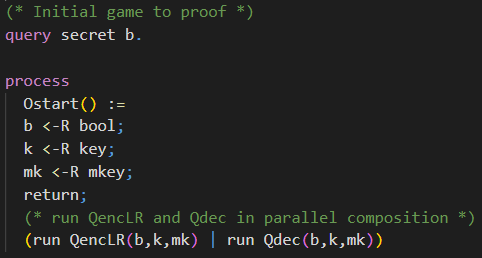

# 💡 Challenges

## Enc-and-MAC

In the first challenge we will consider the
<a href="https://en.wikipedia.org/wiki/Authenticated_encryption#Encrypt-and-MAC_(E&M)" target="_blank">Enc-and-MAC</a>
construction. The assumptions on the cryptographic primitives are the same as in the chapter **First Proof**. The symmetric encryption is IND-CPA secure and the MAC is SUF-CMA secure.

**Try** to prove that Enc-and-MAC is IND-CPA secure using CryptoVerif. As you may already know that **cannot be proven** as attacks exist.  
In this challenge you should inspect CryptoVerif´s output and understand why the sequence of games failed.  
Note that CryptoVerif **cannot find attacks**. However, you should use CryptoVerif´s output to derive a concrete attack on the Enc-and-MAC construction.

The Enc-and-MAC construction works as follows.

1. Encrypt the plaintext resulting in a ciphertext.
2. Compute the MAC over the plaintext.
3. Concatenate the ciphertext and this MAC.

You can see a visualization of this construction on the right-hand side.

  
<b>❓ Don´t know how to proceed? Click here.</b>

> The input file is almost the same as _enc-then-MAC-IND-CPA.ocv_ discussed in the chapter **First Proof**.  
> For this task you need to **rewrite the defintion** of _full\_enc_ to match Enc-and-MAC instead of Enc-then-MAC.

 

  
<b>Show solution</b>

  
>  

>    
<b>Solution: Definition Enc-and-MAC</b>

>    
> To rewrite the definition of the Enc-then-MAC encryption to the Enc-and-MAC encryption you need to change what the MAC will be computed over. For Enc-and-MAC we compute the MAC over the plaintext _m_. 
>
>  
>  

>  

>    
<b>Explanation: How the proof fails</b>

>    
> In the IND-CPA proof for Enc-then-MAC presented in the chapter **First Proof** we saw that CryptoVerif was able to merge the branches depending on the value of _b_. This was possible as the expressions were semantically the same in both branches.  
> For the Enc-and-MAC construction this is not possible. When you have a look at the highlighted parts in the CryptoVerif output below, you will see that in the upper branch the MAC is computed over the plaintext _m1_ and in the lower branch over the plaintext _m2_. This prevents merging those branches. At this point CryptoVerif does not find another way to prove the secrecy of _b_.
> 
>  

>  

>    
<b>Solution: Derive attack on Enc-and-MAC</b>

>  <!--- TODO: Derive attack --->
> Now we want to use the output of the failed CryptoVerif proof to derive an attack against Enc-and-MAC.
>  

## Enc-then-MAC IND-CCA2

In the second challenge we will consider the
<a href="https://en.wikipedia.org/wiki/Authenticated_encryption#Encrypt-and-MAC_(E&M)" target="_blank">Enc-then-MAC</a>
construction again. The assumptions on the cryptographic primitives are the same as in the chapter **First Proof**. The symmetric encryption is IND-CPA secure and the MAC is SUF-CMA secure.  
Your goal is to prove that Enc-then-MAC is then
<a href="https://en.wikipedia.org/wiki/Ciphertext_indistinguishability#Indistinguishability_under_chosen_ciphertext_attack/adaptive_chosen_ciphertext_attack_(IND-CCA1,_IND-CCA2)" target="_blank">IND-CCA2</a>
secure using CryptoVerif.

You can orientate yourself on the input file
<a href="https://bblanche.gitlabpages.inria.fr/CryptoVerif/tutorial/enc-then-MAC-IND-CPA.ocv" target="_blank">_enc-then-MAC-IND-CPA.ocv_</a>
presented in the chapter **First Proof**. You may require to have a look at hints 4 and 5 as they contain CryptoVerif syntax not captured in this tutorial beforehand.

<!--- Hints IND-CCA2 --->

  
<b>❓ Need any hints? Click here.</b>

  
>  

>    
<b>💡 Hint 1</b>

>    
> Consider the **differences** between the **IND-CPA** game and the **IND-CCA2** game. What is new?
>  

>  
>  

>    
<b>💡 Hint 2</b>

>    
> The IND-CCA2 game requires a decryption oracle.  
> Did you tell CryptoVerif how the **Enc-then-MAC decryption** looks like?
>>  

>>    
<b>Solution: Decryption Enc-then-MAC</b>

>>    
>>  
>>  

>  

>  
>  

>    
<b>💡 Hint 3</b>

>    
> The IND-CCA2 game requires a decryption oracle.  
> Did you add the **decryption oracle**? You can orientate yourself on the encryption oracle presented in the chapter **First Proof**.  
> Note that you should not implement the decryption oracle as a left-or-right oracle.
>  

>  
>  

>    
<b>💡 Hint 4</b>

>    
> Did you remember to **exclude** how any adversary can **trivially win** the IND-CCA2 game?  
> You may use tables in CryptoVerif to do so. Check the syntax of tables in CryptoVerif below.
>>  

>>    
<b>CryptoVerif Syntax: Tables</b>

>>    
>>  
>>  

>  

>  
>  

>    
<b>💡 Hint 5</b>

>    
> In the IND-CCA2 game the adversary can access the encryption oracle and the decryption oracle. The adversary can choose the order he makes requests to the oracles but in CryptoVerif only one oracle can be called at a time.  
> Check the syntax of parallel composition of oracles in CryptoVerif below.
>>  

>>    
<b>CryptoVerif Syntax: Parallel composition of oracles</b>

>>    
>>  
>>  

>  

 

<!--- Solution IND-CCA2 --->

  
<b>Show solution</b>

  
>  

>    
<b>Solution: Decryption Enc-then-MAC</b>

>
>  
>
> The Enc-then-MAC decryption function _full\_dec_ has three parameters. It requires the ciphertext _c_ of type _bitstringt_, the encryption key _k_ of type _key_, and the MAC key _mk_ of type _mkey_.  
> First, it separates the ciphertext _c_ of the Enc-then-MAC encryption back to the “regular” ciphertext _c1_ and the MAC _mac1_. If the ciphertext _c_ was of incorrect format and therefore could not be split into _c1_ and _mac1_, the function returns bottom.  
> Then, it is checked whether the MAC _mac1_ is valid. This is done by calling the verification function _verify_ providing the ciphertext _c1_, the MAC key _mk_, and the MAC _mac1_ as parameters. If the verification succeeds, the decryption of the ciphertext _c1_ under the decryption key (same as the encryption key) _k_ is returned. If the verification fails, the function returns bottom.
>  

>
>  

>    
<b>Solution: Enc and Dec oracle (exclude trivial win)</b>

>    
>  
>
> The encryption oracle _QencLR_ is almost the same as in the IND-CPA proof presented in the chapter **First Proof**. As we need to give an adversary access to a decryption oracle, we require to prevent that an adversary can win the IND-CCA2 game trivially. That is excluding that an adversary can send a ciphertext produced by the encryption oracle directly to the decryption oracle.  
> We do this by keeping track of the outputed ciphertexts in a table. First, we create a table called _ciphertexts_ which can contain elements of the type _bitstring_. Inside the oracle _Oenc_ we will insert the generated ciphertext _c0_ into the table.
>
> The decryption oracle _Qdec_ has two paramaters. It requires the encryption key _k_ of type _key_ and the MAC key _mk_ of type _mkey_. Similar to the encryption oracle we use oracle replication for the decryption oracle as well. The oracle _Odec_ takes a ciphertext _c_ as input. Note that the decryption oracle is not a left-or-right oracle, so we do not have inputs like _c1_ and _c2_. We check if the ciphertext _c_, queried by the adversary, is inside the table _ciphertexts_ and has thereby been outputed by the encryption oracle earlier. If this is the case the function returns bottom. Otherwise the Enc-then-MAC decryption is returned.
>
> The parameters _qEnc_ and _qDec_ used for the oracle replication are declared at the top of the input file.  
>  
>  

>
>  

>    
<b>Solution: Initial Game</b>

>    
>  
>
> The initial game is almost the same as the initial game for the IND-CPA game presented in the chapter **First Proof**. The only difference is that the adversary has access to a decryption oracle additionally. We achieve this by running both oracles in parallel composition (check Hint 5).
>  

 

Take a look at the last game and convince yourself that the secrecy of _b_ can be proven in Game 14.

  
<b>Show last game</b>

