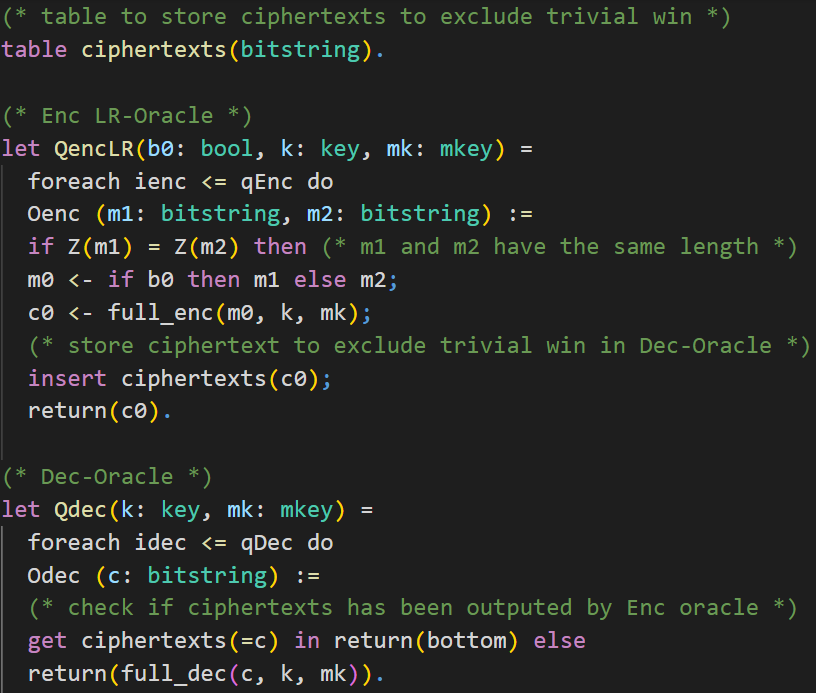

# 💡 Challenges

## Enc-and-Mac
> Try to prove Enc-and-Mac is IND-CPA (which it is NOT).  
> Try to understand why proof fails in CryptoVerif.

In the first challenge we will consider the
<a href="https://en.wikipedia.org/wiki/Authenticated_encryption#Encrypt-and-MAC_(E&M)" target="_blank">Enc-and-Mac</a>
construction. The assumptions on the cryptographic primitives are the same as in the chapter **First Proof**. The symmetric encryption is IND-CPA secure and the MAC is SUF-CMA secure.

**Try** to prove that Enc-and-Mac is IND-CPA secure using CryptoVerif. As you may already know that cannot be proven as attacks exist.  
In this challenge you should inspect CryptoVerif´s output and understand why the sequence of games failed.  
Note that CryptoVerif **cannot find attacks**. However, you should use CryptoVerif´s output to derive a concrete attack on the Enc-and-Mac construction.


The Enc-and-Mac construction works as follows.

1. Encrypt the plaintext resulting in a ciphertext.
2. Compute the Mac over the plaintext.
3. Concatenate the ciphertext and this Mac.

You can see a visualization of this construction on the right-hand side.

<details>
  <summary>❓ Don´t know how to proceed? Click here.</summary>


> The input file is almost the same as _enc-then-MAC-IND-CPA.ocv_ discussed in the chapter **First Proof**.  
> For this task you need to **rewrite the defintion** of _full\_enc_ to match Enc-and-Mac instead of Enc-then-Mac.
</details>

> **Solution**:  
> 1. rewritten definition of Enc-and-Mac (should be super easy that students understand themselves)  
> 2. explanation what the problem is (cannot merge branches in Game 7)

<details>
  <summary><b>Show solution</b></summary>
  
  <details>
    <summary><b>Solution: Definition Enc-and-Mac</b></summary>
    
  
  </details>

  <details>
    <summary><b>Explanation: How the proof fails</b></summary>
    
> Insert Explanation how proof fails
  </details>
</details>

> Emphasize that CryptoVerif **cannot** prove insecurity of protocols.
> derive attack on Enc-and-Mac using failed proof


## Enc-then-Mac IND-CCA2
<!--- Links to IND-CPA, IND-CCA2,... --->
> Prove Enc-then-Mac is IND-CCA2

<a href="https://en.wikipedia.org/wiki/Ciphertext_indistinguishability#Indistinguishability_under_chosen_ciphertext_attack/adaptive_chosen_ciphertext_attack_(IND-CCA1,_IND-CCA2)" target="_blank">IND-CCA2</a>

> **Hints**:  
> 1.1 consider the differences between IND-CPA and IND-CCA2  
> 1.2 told CryptoVerif how Enc-then-Mac is decrypted?  
> 1.3 added oracle for decryption?  
> 1.4 remember that if branches cannot be merged  
> 2.1 Remember to exclude trivial win  
> 2.2 tables syntax:

```
table tbl_name(type_to_store).
insert tbl_name(obj_to_insert);
get tbl_name(=obj_to_search) in do_true else do_false
```
	
> 3 run oracles simultaneous:

```
(run Oracle1(a,b) | run Oracle2(c,d,e))
```
	

> **Solution**:  
> 1. Add _full\_dec()_  
> 2. Add Dec oracle  
> 3. modify Enc and Dec oracle to exclude trivial win (using table of ciphertexts)  
> 4. run oracles simultaneous

<details>
  <summary><b>Show solution</b></summary>
  
  <details>
    <summary><b>Solution: Decryption Enc-then-Mac</b></summary>
    
  
  </details>

  <details>
    <summary><b>Solution: Enc and Dec oracle (excluding trivial win)</b></summary>
    
  
  
  
  </details>

  <details>
    <summary><b>Solution: Initial Game</b></summary>
    
  
  </details>
</details>
