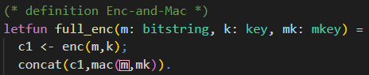
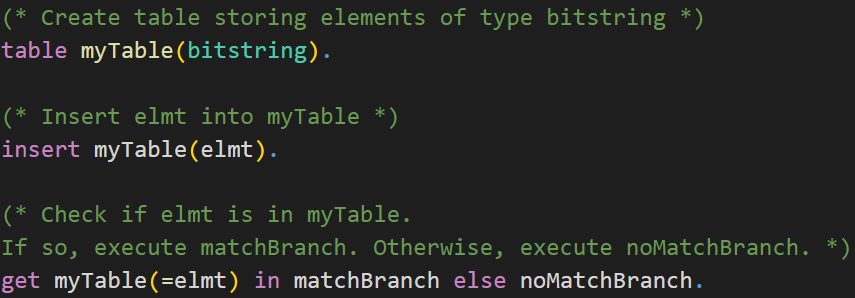

# 💡 Challenges

## Enc-and-Mac
> Try to prove Enc-and-Mac is IND-CPA (which it is NOT).  
> Try to understand why proof fails in CryptoVerif.

In the first challenge we will consider the
<a href="https://en.wikipedia.org/wiki/Authenticated_encryption#Encrypt-and-MAC_(E&M)" target="_blank">Enc-and-Mac</a>
construction. The assumptions on the cryptographic primitives are the same as in the chapter **First Proof**. The symmetric encryption is IND-CPA secure and the MAC is SUF-CMA secure.

**Try** to prove that Enc-and-Mac is IND-CPA secure using CryptoVerif. As you may already know that cannot be proven as attacks exist.  
In this challenge you should inspect CryptoVerif´s output and understand why the sequence of games failed.  
Note that CryptoVerif **cannot find attacks**. However, you should use CryptoVerif´s output to derive a concrete attack on the Enc-and-Mac construction.

The Enc-and-Mac construction works as follows.

1. Encrypt the plaintext resulting in a ciphertext.
2. Compute the Mac over the plaintext.
3. Concatenate the ciphertext and this Mac.

You can see a visualization of this construction on the right-hand side.

  
❓ Don´t know how to proceed? Click here.

> The input file is almost the same as _enc-then-MAC-IND-CPA.ocv_ discussed in the chapter **First Proof**.  
> For this task you need to **rewrite the defintion** of _full\_enc_ to match Enc-and-Mac instead of Enc-then-Mac.

> **Solution**:  
> 1. rewritten definition of Enc-and-Mac (should be super easy that students understand themselves)  
> 2. explanation what the problem is (cannot merge branches in Game 7)

  
<b>Show solution</b>

  
>  

>    
<b>Solution: Definition Enc-and-Mac</b>

>    
>  
>  

>
>  

>    
<b>Explanation: How the proof fails</b>

>    
> Insert Explanation how proof fails
>  

>
>  

>    
<b>Solution: Derive attack on Enc-and-Mac</b>

>    
> Use failed CryptoVerif game to derive attack
>  

## Enc-then-Mac IND-CCA2
<!--- Links to IND-CPA, IND-CCA2,... --->
> Prove Enc-then-Mac is IND-CCA2

In the second challenge we will consider the
<a href="https://en.wikipedia.org/wiki/Authenticated_encryption#Encrypt-and-MAC_(E&M)" target="_blank">Enc-then-Mac</a>
construction again. The assumptions on the cryptographic primitives are the same as in the chapter **First Proof**. The symmetric encryption is IND-CPA secure and the MAC is SUF-CMA secure.  
Your goal is to prove that Enc-then-Mac is then
<a href="https://en.wikipedia.org/wiki/Ciphertext_indistinguishability#Indistinguishability_under_chosen_ciphertext_attack/adaptive_chosen_ciphertext_attack_(IND-CCA1,_IND-CCA2)" target="_blank">IND-CCA2</a>
secure using CryptoVerif.

You can orientate yourself on the input file
<a href="https://bblanche.gitlabpages.inria.fr/CryptoVerif/tutorial/enc-then-MAC-IND-CPA.ocv" target="_blank">_enc-then-MAC-IND-CPA.ocv_</a>
presented in the chapter **First Proof**.

<!--- Hints IND-CCA2 --->

  
<b>❓ Need any hints? Click here.</b>

  
>  

>    
<b>💡 Hint 1</b>

>    
> Consider the **differences** between the **IND-CPA** game and the **IND-CCA2** game. What is new?
>  

>  
>  

>    
<b>💡 Hint 2</b>

>    
> The IND-CCA2 game requires a decryption oracle.  
> Did you tell CryptoVerif how the **Enc-then-Mac decryption** looks like?
>>  

>>    
<b>Solution: Decryption Enc-then-Mac</b>

>>    
>>  
>>  

>  

>  
>  

>    
<b>💡 Hint 3</b>

>    
> The IND-CCA2 game requires a decryption oracle.  
> Did you add the **decryption oracle**? You can orientate yourself on the encryption oracle presented in the chapter **First Proof**.  
> Note that you should not implement the decryption oracle as a left-or-right oracle.
>  

>  
>  

>    
<b>💡 Hint 4</b>

>    
> Did you remember to **exclude** how any adversary can **trivially win** the IND-CCA2 game?  
> You may use tables in CryptoVerif to do so. Check the syntax of tables below.
>>  

>>    
<b>CryptoVerif Syntax: Tables</b>

>>    
>>  
>>  

>  

>  
>  

>    
<b>💡 Hint 5</b>

>    
> In the IND-CCA2 game the adversary can access the encryption oracle and the decryption oracle simultaneously.  
> Check the syntax of running oracles simulateously below.
>>  

>>    
<b>CryptoVerif Syntax: Run oracles simultaneously</b>

>>    
>>  
>>  

>  

> **Solution**:  
> 1. Add _full\_dec()_  
> 2. Add Dec oracle  
> 3. modify Enc and Dec oracle to exclude trivial win (using table of ciphertexts)  
> 4. run oracles simultaneous

<!--- Solution IND-CCA2 --->

  
<b>Show solution</b>

  
  

    
<b>Solution: Decryption Enc-then-Mac</b>

> Explain solution
    
  
  

  

    
<b>Solution: Enc and Dec oracle (exclude trivial win)</b>

    
  
  
  
  

  

    
<b>Solution: Initial Game</b>

    
  
  

