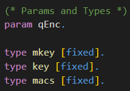

# 📚 First Proof
<!---
TODO:
how parameters of oracles are defined
difference Oracle and Process
--->

In this chapter we will have a look at a first proof using CryptoVerif. You will be guided to gather an understanding of how to work with CryptoVerif.  

We will consider the 
<a href="https://en.wikipedia.org/wiki/Authenticated_encryption#Encrypt-then-MAC_(EtM)" target="_blank">Enc-then-Mac</a>
construction. Our goal is to show that Enc-then-Mac is
<a href="https://en.wikipedia.org/wiki/Ciphertext_indistinguishability#Indistinguishability_under_chosen-plaintext_attack_(IND-CPA)" target="_blank">IND-CPA</a>
secure, assuming the symmetric encryption is
<a href="https://en.wikipedia.org/wiki/Ciphertext_indistinguishability#Indistinguishability_under_chosen-plaintext_attack_(IND-CPA)" target="_blank">IND-CPA</a>
secure and the MAC is
<a href="https://en.wikipedia.org/wiki/Digital_signature_forgery#Weak_existential_forgery_(strong_existential_unforgeability,_strong_unforgeability;_sEUF,_or_SUF)" target="_blank">SUF-CMA</a>
secure.

## Enc-then-Mac

The Enc-then-Mac construction works as follows.

1. Encrypt the plaintext resulting in a ciphertext.
2. Compute the Mac over this ciphertext.
3. Concatenate the ciphertext and this Mac.

You can see a visualization of this construction on the right-hand side.

## Input file
In this section we will build the input file for the proof together. CryptoVerif takes this file and tries to prove the queries we defined using the sequence of games technique.

> ℹ️ Note that we will not strictly walk through every line of code from the top to the bottom. We will skip some lines for didactic reasons and explain them in the last section **Further Code**.

### Cryptographic assumptions
We start with the cryptographic assumptions we make for the cryptographic primitives used. In our case this is that the symmetric encryption is IND-CPA secure and the MAC is SUF-CMA secure.

CryptoVerif provides a library containing many standard cryptographic assumptions you can use (see
<a href="https://github.com/cn-lk666/CryptoVerif/blob/main/manual.pdf" target="_blank">manual</a>
, Chapter 6). But you can also create your own assumptions.

You can see the code snippets for telling CryptoVerif that _enc_ is IND-CPA secure and _mac_ is SUF-CMA secure in the following.

> explain technical side: e.g. IND-CPA replaces message with Z(m1),Z(m2) (same bitstring)

### Definition Enc-then-Mac
> letfun full_enc()

### Initial game to prove (including oracles)
> QencLR (oracle)  
> talk about replication (foreach i <= qEnc do)  
> param qEnc. definded at top of file  
> if branches cannot be merged  

> OStart (first game)  
> talk about queries (query secret b.)  
> talk about run  

### Further Code
> type mkey [fixed]. etc.  
> fun concat

You can find the input file _enc-then-MAC-IND-CPA.ocv_
<a href="https://bblanche.gitlabpages.inria.fr/CryptoVerif/tutorial/enc-then-MAC-IND-CPA.ocv" target="_blank">here</a>.