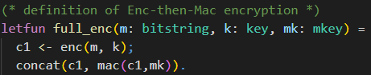
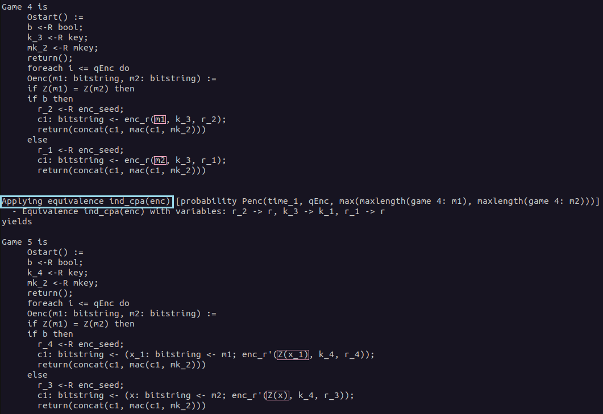

# 📚 First Proof

In this chapter we will have a look at a first proof using CryptoVerif. You will be guided to gather an understanding of how to work with CryptoVerif.  

We will consider the 
<a href="https://en.wikipedia.org/wiki/Authenticated_encryption#Encrypt-then-MAC_(EtM)" target="_blank">Enc-then-Mac</a>
construction. Our goal is to show that Enc-then-Mac is
<a href="https://en.wikipedia.org/wiki/Ciphertext_indistinguishability#Indistinguishability_under_chosen-plaintext_attack_(IND-CPA)" target="_blank">IND-CPA</a>
secure, assuming the symmetric encryption is
<a href="https://en.wikipedia.org/wiki/Ciphertext_indistinguishability#Indistinguishability_under_chosen-plaintext_attack_(IND-CPA)" target="_blank">IND-CPA</a>
secure and the MAC is
<a href="https://en.wikipedia.org/wiki/Digital_signature_forgery#Weak_existential_forgery_(strong_existential_unforgeability,_strong_unforgeability;_sEUF,_or_SUF)" target="_blank">SUF-CMA</a>
secure.

## Enc-then-Mac


The Enc-then-Mac construction works as follows.

1. Encrypt the plaintext resulting in a ciphertext.
2. Compute the Mac over this ciphertext.
3. Concatenate the ciphertext and this Mac.

You can see a visualization of this construction on the right-hand side.


## Input file
In this section we will build the input file for the proof together. CryptoVerif takes this file and tries to prove the queries we defined using the sequence of games technique.

> ℹ️ Note that we will not strictly walk through every line of code from the top to the bottom. We will skip some lines for didactic reasons and explain them at the appropriate places.


### Cryptographic assumptions
We start with the cryptographic assumptions we make for the cryptographic primitives used. In our case this is that the symmetric encryption is IND-CPA secure and the MAC is SUF-CMA secure.

CryptoVerif provides a library containing many standard cryptographic assumptions you can use (see _docs/manual.pdf_, Chapter 6). But you can also create your own assumptions.

You can see the code snippets for telling CryptoVerif that _enc_ is IND-CPA secure and _mac_ is SUF-CMA secure in the following.


> talk about where to put "." 

<!--- check if defined is correct word for these macros --->
Here the already in the default library _default.ocvl_ defined macros _IND\_CPA\_sym\_enc_ and _SUF\_CMA\_det\_mac_ are expanded. For a better understanding we will discuss the technical side with the example of the _IND\_CPA\_sym\_enc_ marco.

First, let us inspect the meaning of the parameters of this macro.

1. type of keys
2. type of plaintexts
3. type of ciphertexts
4. encryption function
5. decryption function
6. function to inject the type bitstring to the type bitstringbot (The decryption returns either a bitstring (plaintext) or bottom (when the decryption fails). The type bitstringbot contains all bitstrings and bottom and is the return type of the decryption function.)
7. function from bitstring to bitstring (This function models the leakage of the encryption. We usually interpret this as the leakage of the length of the plaintext.)
8. probability of breaking the IND-CPA property

The functions _enc_, _dec_, _injbot_ and _Z_ are declared by the macro. It is important that they are not declared anywhere else. They can only be used after the macro has been expanded.

The types of keys, plaintexts, ciphertexts and the probability _Penc_ must be declared before expanding the macro.  
As you can see in the code snippet, the probability _Penc_ is declared right before expanding the macro.  
The types of plaintexts and ciphertexts are _bitstring_, a predefined type.  
The type of keys is declared at the top of the input file, depicted in the following code snippet. There are also the type declarations for arguments for the macro _SUF\_CMA\_det\_mac_.


The types are annotated with the lable **[fixed]** meaning that, for example, an encryption key is a bitstring of fixed length. Note that CryptoVerif does not need to know the specific length. Similar as it does not need to know the specific implementation of the symmetric encryption scheme or the MAC.  
Note that it is possible to make an exact specification of the length to CryptoVerif.

> explain technical side: e.g. IND-CPA replaces plaintexts with Z(m1),Z(m2) (same bitstring)  
> talk again that Z models leakage of encryption and we interpret is as the leakage of the length of the plaintext

Now we want to gain a better understanding of how CryptoVerif is doing game transformations. Once again, we will take the IND-CPA assumption as an example.  
Let´s have a look at a code snippet from the macro _IND\_CPA\_sym\_enc_ in the default library _default.ocvl_ depicted below.


> talk about IND-CPA transformation shown above
> explain how CryptoVerif does cryptographic transformations (requirements that need to be satisfied)

### Definition Enc-then-Mac
<!---Correct description of letfun and fun?--->
> letfun full_enc()  
> letfun requires implementation vs fun does not

Further, we need to define how Enc-then-Mac works. Otherwise CryptoVerif would not know what the construction we try to prove looks like.  

For the definition of the Enc-then-Mac construction we will need a function for concatenation. We are not interested in the concrete implementation of this function.  
Therefore, we only declare the function using the keyword **fun**.  
The keyword **letfun** is used when defining a function, i.e., giving a concrete implementation. We will use this one for the definition of the Enc-then-Mac encryption.

The declaration of the concatenation function is shown in the following.


> talk about fun, types and [data]


Now that we talked about the concatenation function, we have everything we need to move on to the Enc-then-Mac construction. The definition of the Enc-then-Mac encryption is depicted in the following.


 
As we want to define the exact behaviour for the Enc-then-Mac encryption we use **letfun** for the definition of the function _full\_enc_.  

> TODO: talk about oracles ()= and where to put ";" and "."  
> sequential execution with ";"

The function has three parameters that are needed.  
First, there is the plaintext _m_ of type _bitstring_. In CryptoVerif we consider plain- and ciphertexts as bitstrings. This means we consider cryptographic primitives (e.g. encryption) as mappings from bitstrings to bitstrings.  
Further there are the encryption key _k_ of type _key_, and the MAC key _mk_ of type _mkey_.

We will use the encryption function _enc_ declared inside of the macro _IND\_CPA\_sym\_enc_ to compute the encryption of the plaintext _m_ under the encryption key _k_. This ciphertext is then stored inside the variable _c1_.  
Next, we concatenate the ciphertext _c1_ with the MAC of the ciphertext _c1_ under the MAC key _mk_. This concatenation is the result of our Enc-then-Mac encryption function _full\_enc_.


### Initial game to prove (including oracles)
Now we want to construct the initial game CryptoVerif should try to proof using the sequence of games. In our example this is the IND-CPA game. Note that for many games there are oracles the adversary can query. Here, an encryption oracle from the IND-CPA game is required. We will start with this oracle before proceeding with the initial game.  

> QencLR (oracle)  difference = and :=
> adversary makes calls to the oracle(s) (interaction)

The code of the encryption oracle is depicted below.


> talk about keyword **let** and oracles  
> talk about equivalency of IND-CPA and LoR-CPA

The oracle is implemented as a left-or-right oracle. That means that the oracle receives two plaintexts in each query made by the adversary and always encrypts the left plaintext or always encrypts the right plaintext depending on the value of _b_.

> talk about replication (foreach i <= qEnc do)  
> param qEnc. at top of file  (no real number) (just put into adversary advantage)
> if branches cannot be merged  


> OStart (first game)  
> talk about queries (query secret b.)  
> talk about run  
> no "." because end of file
> talk about main process and sub processes


## Execute
The input file is now ready and we can execute CryptoVerif to let it try proof our query.  
You can find the input file _enc-then-MAC-IND-CPA.ocv_
<a href="https://bblanche.gitlabpages.inria.fr/CryptoVerif/tutorial/enc-then-MAC-IND-CPA.ocv" target="_blank">here</a>.

<!--- TODO: Where to put input file --->
When in the same directory as the executable _cryptoverif_ you can run CryptoVerif on our created input file using the following command.

<!--- fix path -->
```
./cryptoverif ./path/enc-then-MAC-IND-CPA.ocv
```

> explain output of CryptoVerif  

> show IND-CPA game hop. replacement of x with Z(x) as explained before

<details>
  <summary>Show IND-CPA game hop</summary>


</details>


> emphasize last game hop as preparation for the first challenge  
> show Merging game hop

<details>
  <summary>Show Merging game hop</summary>


</details>

> explain advantage (put together through games e.g. Penc from ind_cpa hop)


> add TeX output with -tex
<!--- fix path -->
```
mkdir tex
./cryptoverif -tex ./tex/enc-then-MAC-IND-CPA ./path/enc-then-MAC-IND-CPA.ocv
```

You can view the PDF with a TeX editor of your choice (e.g. 
<a href="https://www.texstudio.org/" target="_blank">TeXstudio</a>).  
Alternatively, you can simply use an 
<a href="https://www.tutorialspoint.com/online_latex_editor.php" target="_blank">Online LaTeX Editor</a>
to display the PDF without any installation required.