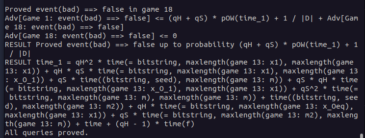

# 🔧 Installation

> ℹ️ This tutorial only shows how to install CryptoVerif and its requirements on **Ubuntu**.  
> It is also possible to run CryptoVerif under other Linux distributions, MacOS, and Windows.  
> For more information, take a look at the _README_ file in the downloaded CryptoVerif folder.

**DIY Links:**
<a href="https://ocaml.org/docs/up-and-running" target="_blank">OCaml</a>,
<a href="https://opam.ocaml.org/doc/Install.html" target="_blank">opam</a>

## Download CryptoVerif
CryptoVerif can be downloaded
<a href="https://bblanche.gitlabpages.inria.fr/CryptoVerif/" target="_blank">here</a>.
​
1. Click on the “Source” download link,
2. Scroll to the very bottom of the page and accept the terms,
3. Accept again in the popup window,
4. Download _cryptoverif2.06.tar.gz_ to a location of your choosing.

## Install OCaml (4.03 or higher)
CryptoVerif requires OCaml version 4.03 or higher to be installed. The easiest way to install OCaml is to use its package manager opam. The following three commands are meant to be executed as root, or with `sudo` ([source](https://opam.ocaml.org/doc/Install.html#Ubuntu)):

```
add-apt-repository ppa:avsm/ppa
apt update
apt install opam
```

For CryptoVerif to work, it is important to install the OCaml compiler as well. This is taken care of by the following two commands, execute them as normal user ([source](https://ocaml.org/docs/up-and-running#initialising-opam-on-unix)).
After the execution of the first command, you may be asked if you want to modify the file `~/.profile`. You can answer with the default "N".
When asked if you want to add a hook, you can answer with the default "y".

```
opam init
eval $(opam env)
```
	
Check if the installation was successful with the following command.

```
ocaml -version
```

## Install CryptoVerif
First, you need to decompress the previously downloaded _cryptoverif2.06.tar.gz_.

```
tar -xzf cryptoverif.2.06.tar.gz
```
	
Build the programs using the following commands.

```
cd cryptoverif2.06
./build
```
	
Further, CryptoVerif requires the OCaml cryptographic library _cryptokit_ to be installed.

```
opam install cryptokit
```
	
## Test for successful installation
Let’s try to run CryptoVerif on an example protocol. You need to be in the directory _cryptoverif2.06_ where the executable _cryptoverif_ is located, before executing the following command.

```
./cryptoverif examples/basic/pfdh.cv
```
	
The end of the result should look like this:



> ℹ️ Having problems with the installation? Take a look at the _README_ file in the downloaded CryptoVerif folder.


