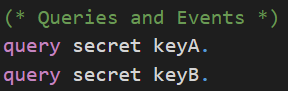
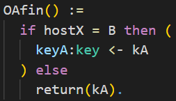
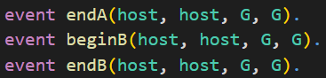
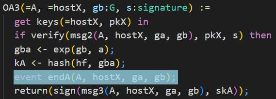
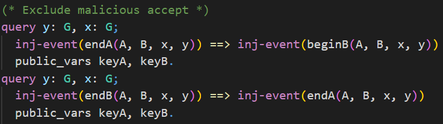
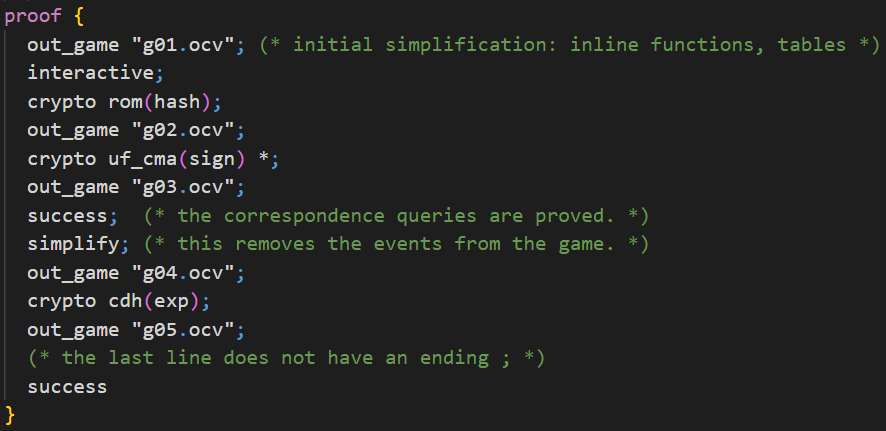

# 📝 Self-Study

In this chapter you are welcome to have a look at how CryptoVerif proves the authenticated key exchange protocol _signed Diffie-Hellman_ secure in a multi-party, multi-session environment.

We will not have an in-depth look at every line of the input file as in the chapter **First Proof**. You will recognize many similar structures. We will have a look at some code snippets discussing the most important differences.  
One interesting aspect, for example, is how CryptoVerif excludes _malicious accepts_.  
Further, in this proof you can see how CryptoVerif can be guided through the proof (interactive mode). 

You can find the input file _signedDH.ocv_
<a href="https://bblanche.gitlabpages.inria.fr/CryptoVerif/tutorial/signedDH.ocv" target="_blank">here</a>.

## Secrecy of session key

The queries to prove secrecy of to session key _keyA_ and _keyB_ have the same syntax as we have seen before to prove the secrecy of bit _b_.

The difference here is that the values of _keyA_ and _keyB_ are depending on the messages the communicating parties have sent each other (key agreement).  
We only want to prove secrecy in case the two honest parties _A_ and _B_ interacted. There is a problem where another party besides _B_ can communicate with party _A_ and trivially know the agreed key. Because of this you can see a little trick in the following code snippet. The value of the agreed key is stored in _kA_ at first. Only if the other party is _B_ then the value of _keyA_ is set to _kA_. Otherwise, _kA_ will be directly leaked.

## Events

In CryptoVerif we can also use events. You can see the declaration of the events _endA_, _beginB_, and _endB_ in the following. They also have parameters of the given types associated to them.

In the following you can see in the highlighted part how it looks when a event is recorded. In this example this is the event _endA_. We will use these events later on to proof that a _malicious accept_ is not possible.

From the code depicted above you can also understand that the messages of a protocol exchanged between the communicating parties are defined as oracles in CryptoVerif.

## Exclude malicious accept

Now we want CryptoVerif to proof that a _malicious accept_ is not possible. For this we write queries using the events _endA_, _beginB_, and _endB_ shown in the previous section.

In the upper query we want to prove that for each event _endA_ there exists one distinct event _beginB_ with the same parameters. This should be proven even if the shared secrets _keyA_ and _keyB_ are leaked. We indicate this using the keyword **public_vars**.  
To be more precise, when this query is proven it means that party _A_ can authenticate party _B_, even if any shared secrets leaks.

The lower query is the other way around. We want to show that _B_ can authenticate _A_, even if any shared secret is leaked. For each event _endB_ there exists one distinct event _endA_ with the same parameters.

## Interactive mode

It is possible to run CryptoVerif in interactive mode. This might be neccessary for complex protocols. In the interactive mode you can guide CryptoVerif through the proof. In this section we will have a look on how to use the interactive mode.

We need to add a _proof_ environment to the input file as depicted above. With the keyword **out_game** we can specify a filename and save the current game inside. To make the proof interactive we use the keyword **interactive**. Note that this way the CryptoVerif will ask in the console for the next command and thereby ignores the rest inside the _proof_ environment. If you would delete the **interactive** keyword CryptoVerif would follow this given proof structure. You can take this part which is ignored to know what commands you should type in the console in interactive mode of CryptoVerif.

You can apply a cryptographic assumption on a function using a command like **crypto assumption(function)**. This will apply the defined equivalence (compare _ind\_cpa(enc)_ in the chapter **First Proof**). In our example we will apply the ROM assumption on the hashfunction _hash_ first. The second cryptographic assumption we apply is the UF-CMA assumption on the signature function _sign_. The protocol uses this signature function multiple times and therefore we also want to apply the assumption multiple times we need to indicate this by adding a star a the end of the command.  
In interactive mode you can type the command **success** at any time and CryptoVerif will try to prove the queries. When you type the command **success** after applying the two assumptions mentioned before, you can see that the queries for excluding _malicious accepts_ can already be proven at this point. The remaining queries for the secrecy of _keyA_ and _keyB_ remain unproven. Use the command **simplify** to simplify the current game. At this point this would remove the events from the current game as they are no longer needed.  
Next, apply the CDH assumption on the function _exp_. After this you can use the command **success** again and you will see that now all queries have been proven.

During interacitve mode the command **quit** can be used to leave interactive mode and CryptoVerif continues non-interactively.

> ℹ️ Note that CryptoVerif is also able to prove the Signed DH protocol in automatic mode.