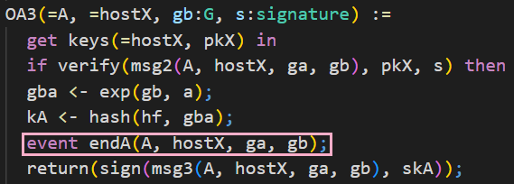

# 📝 Self-Study

In this chapter you are welcome to have a look at how CryptoVerif proves the authenticated key exchange protocol _signed Diffie-Hellman_ secure in a multi-party, multi-session environment.

We will not have an in-depth look at every line of the input file as in the chapter **First Proof**. You will recognize many similar structures. We will have a look at some code snippets discussing the most important differences.  
One interesting aspect, for example, is how CryptoVerif excludes _malicious accepts_.  
Further, in this proof you can see how CryptoVerif can be guided through the proof (interactive mode). 

You can find the input file _signedDH.ocv_
<a href="https://bblanche.gitlabpages.inria.fr/CryptoVerif/tutorial/signedDH.ocv" target="_blank">here</a>.

## Secrecy of session key

The queries to prove secrecy of to session key _keyA_ and _keyB_ have the same syntax as we have seen before to prove the secrecy of bit _b_.

The difference here is that the values of _keyA_ and _keyB_ are depending on the messages the communicating parties have sent each other (key agreement).  
We only want to prove secrecy in case the two honest parties _A_ and _B_ interacted. There is a problem where another party besides _B_ can communicate with party _A_ and trivially know the agreed key. Because of this you can see a little trick in the following code snippet. The value of the agreed key is stored in _kA_ at first. Only if the other party is _B_ then the value of _keyA_ is set to _kA_. Otherwise, _kA_ will be directly leaked.

## Events
> talk about events  
> trigger: "record event"  

In CryptoVerif we can also use events. You can see the declaration of the events _endA_, _beginB_, and _endB_ in the following. They also have parameters of the given types associated to them.

From the code depicted above you can also understand that the single messages of a protocol are defined as oracles in CryptoVerif.

## Exclude malicious accept
> talk about query using events (exclude malicious accept)  

Now we want CryptoVerif to proof that a malicious accept is not possible. For this we write queries using the events _endA_, _beginB_, and _endB_ shown in the previous section.

In the upper query we want to prove that for each event _endA_ there exists one distinct event _beginB_ with the same parameters. This should be proven even if the shared secrets _keyA_ and _keyB_ are leaked. We indicate this using the keyword **public_vars**.  
To be more precise, when this query is proven it means that party _A_ can authenticate party _B_, even if any shared secrets leaks.

The lower query is the other way around. We want to show that _B_ can authenticate _A_, even if any shared secret is leaked. For each event _endB_ there exists one distinct event _endA_ with the same parameters.

## Interactive mode
> talk about interactive mode (guided)  
> refer back to IND-CPA equivalence (use ind_cpa(enc) in interactive mode)

